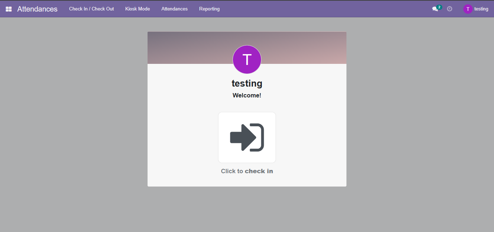
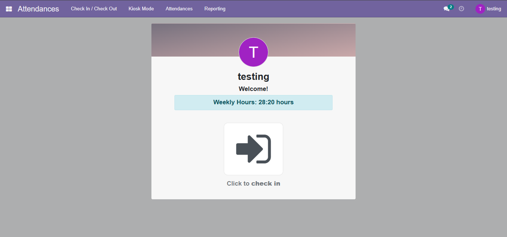
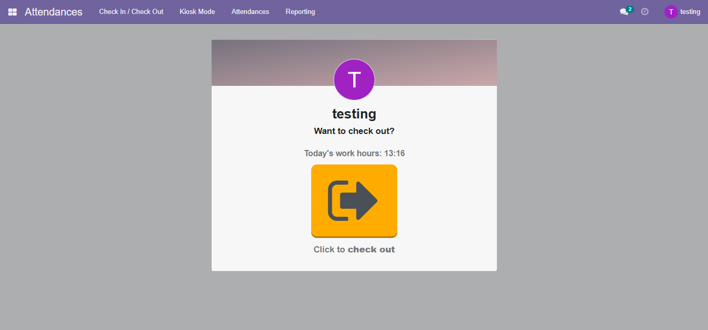
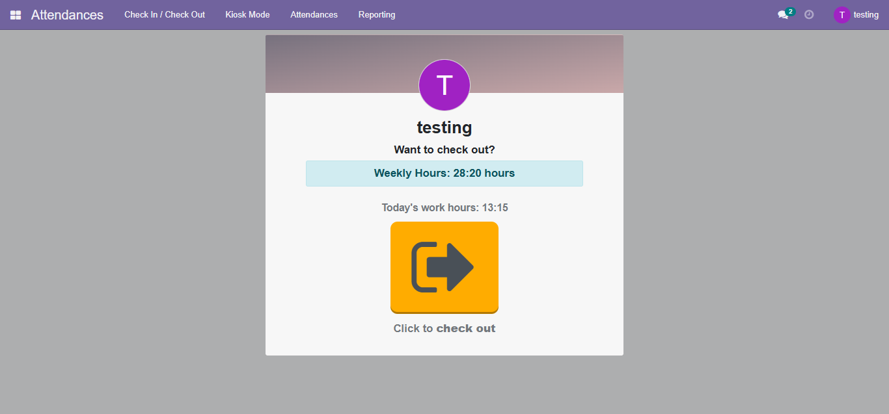

# Crear un campo en el módulo de asistencias en la vista de Check In / Check Out en el que se muestre el total de horas laboradas durante cada semana

- Antes

- Después

- Antes

- Después

- Código realizado para insertar el cuadro con la cantidad de horas trabajadas durante la semana

    [hr_attendance_extension](../bitacora9/hr_attendance_extension/)